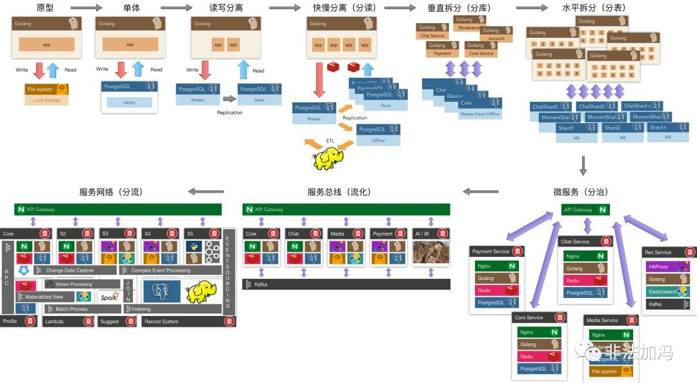
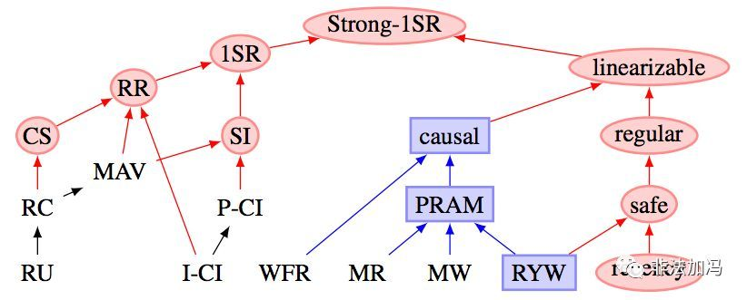

# 为什么要学数据库原理？
[cnblogs__原文](https://www.cnblogs.com/feng9exe/p/9914516.html)

只会写代码的是码农；学好数据库，基本能混口饭吃；在此基础上再学好操作系统和计算机网络，就能当一个不错的程序员。如果能再把离散数学、数字电路、体系结构、数据结构/算法、编译原理学通透，再加上丰富的实践经验与领域特定知识，就能算是一个优秀的工程师了。

**计算机其实就是存储/IO/CPU三大件； 而计算说穿了就是两个东西：数据与算法（状态与转移函数）**。常见的软件应用，除了各种模拟仿真、模型训练、视频游戏这些属于计算密集型应用外，绝大多数都属于数据密集型应用。从最抽象的意义上讲，这些应用干的事儿就是把数据拿进来，存进数据库，需要的时候再拿出来。

**抽象是应对复杂度的最强武器。 操作系统提供了对存储的基本抽象：内存寻址空间与磁盘逻辑块号。 文件系统在此基础上提供了文件名到地址空间的KV存储抽象。 而数据库则在其基础上提供了对应用通用存储需求的高级抽象。**

互联网应用大多属于数据密集型应用，对于真实世界的数据密集型应用而言，除非你准备从基础组件的轮子造起，不然根本没那么多机会去摆弄花哨的数据结构和算法。甚至写代码的本事可能也没那么重要：可能只会有那么一两个Ad Hoc算法需要在应用层实现，大部分需求都有现成的轮子可以使用，**主要的创造性工作往往在数据模型与数据流设计上**。实际生产中，***数据表就是数据结构，索引与查询就是算法。而应用代码往往扮演的是胶水的角色，处理IO与业务逻辑，其他大部分工作都是在数据系统之间搬运数据。***

在最宽泛的意义上，有状态的地方就有数据库。它无所不在，网站的背后、应用的内部，单机软件，区块链里，甚至在离数据库最远的Web浏览器中，也逐渐出现了其雏形：各类状态管理框架与本地存储。“数据库”可以简单地只是内存中的哈希表/磁盘上的日志，也可以复杂到由多种数据系统集成而来。关系型数据库只是数据系统的冰山一角（或者说冰山之巅），实际上存在着各种各样的数据系统组件：
* 数据库：存储数据，以便自己或其他应用程序之后能再次找到（PostgreSQL，MySQL，Oracle）
* 缓存：记住开销昂贵操作的结果，加快读取速度（Redis，Memcached）
* 搜索索引：允许用户按关键字搜索数据，或以各种方式对数据进行过滤（ElasticSearch）
* 流处理：向其他进程发送消息，进行异步处理（Kafka，Flink，Storm）
* 批处理：定期处理累积的大批量数据（Hadoop）

架构师最重要的能力之一，就是了解这些组件的性能特点与应用场景，能够灵活地权衡取舍、集成拼接这些数据系统。绝大多数工程师都不会去从零开始编写存储引擎，因为在开发应用时，数据库已经是足够完美的工具了。关系型数据库则是目前所有数据系统中使用最广泛的组件，可以说是程序员吃饭的主要家伙，重要性不言而喻。 图：架构演化：一种分拆方法

对玩具应用而言，使用内存变量与文件来保存状态也许已经绰绰有余了。但随着系统的增长，我们会遇到越来越多的挑战：软硬件故障把数据搞成一团浆糊（可靠性）；状态太多而内存太小放不下（可伸缩性）；并发访问控制导致代码复杂度发生爆炸（可维护性），诸如此类。这些问题相当棘手，却又相当普遍，数据库就是用来解决这些问题的。**分拆是架构演化的重要方法论，数据库将状态管理的职能从应用程序中分拆出来，即所谓的“状态与计算相分离”**。数据库将程序员从重复造轮子的泥潭中解救出来，极大地解放了生产力。

每个系统都服务于一个目的，解决一类问题。问题比方法更重要。但现实很遗憾，以大多数学生，甚至相当一部分公司能接触到的现实问题而言，拿几个文件甚至在内存里放着估计都能应付大多数场景了（需求简单到低级抽象就可以Handle）。没什么机会接触到数据库真正要解决的问题，也就难有真正使用与学习数据库的驱动力，更别提数据库原理了。

所以我也理解当前这种填鸭教学现状的苦衷：工作之后很难有这么大把的完整时间来学习原理了，所以老师只好先使劲灌输，多少让学生对这些知识有个印象。等学生参加工作后真正遇到这些问题，也许会想起大学好像还学了个叫数据库的东西，这些知识就会开始反刍。

数据库，尤其是关系型数据库，非常重要。那为什么要学习其原理呢？

对优秀的工程师来说，只会用数据库是远远不够的。学习原理对于当CRUD BOY搬砖收益并不大，但当通用组件真的无解需要自己撸起袖子上时，没有金坷垃怎么种庄稼？设计系统时，理解原理能让你以最少的复杂度代价写出更可靠高效的代码；遇到疑难杂症需要排查时，理解原理能带来精准的直觉与深刻的洞察。

**数据库是一个博大精深的领域，存储，I/O，计算，无所不包。其主要原理也可以粗略分为几个部分：数据模型设计原理（应用）、存储引擎原理（基础）、索引与查询优化器的原理（性能）、事务与并发控制的原理（正确性）、故障恢复与复制系统的原理（可靠性）。 所有的原理都有其存在意义：为了解决实际问题。**

例如数据模型设计中的范式理论，就是为了解决数据冗余这一问题而提出的，它是为了把事情做漂亮（可维护）。它是模型设计中一个很重要的设计权衡：通常而言，冗余少则复杂度小/可维护性强，冗余高则性能好。具体来说，冗余字段能加快特定类型的读取（通过消除连接），但在写入时就需要做更多的工作：维护多对象副本间的一致性，避免多对象事务并发执行时发生踩踏。这就需要仔细权衡利弊，选择合适的规范化等级。**数据模型设计，就是生产中的数据结构设计**。不了解这些原理，就难以提取良好的抽象，其他工作也就无从谈起

而关系代数与索引的原理，则在查询优化中扮演重要的角色，它是为了把事情做得快（性能，可扩展）。当数据量越来越大，SQL写的越来越复杂时，它的意义就会体现出来：怎样写出等价但是更高效的查询？当查询优化器没那么智能时，就需要人来干这件事。这种优化往往有四两拨千斤的效果，比如一个需要几秒的KNN查询，如果知道R树索引的原理，就可以通过改写查询，创建GIST索引优化到1毫秒内，千倍的性能提升。不了解索引与查询设计原理，就难以充分发挥数据库的性能。  图：估算表膨胀率的复杂SQL一例，能在50ms内完成

**事务与并发控制的原理，是为了把事情做正确。事务是数据处理领域最伟大的抽象之一，它提供了很多有用的保证（ACID)**，但这些保证到底意味着什么？事务的原子性让你在提交前能随时中止事务并丢弃所有写入，相应地，事务的持久性则承诺一旦事务成功提交，即使发生硬件故障或数据库崩溃，写入的任何数据也不会丢失。这让错误处理变得无比简单，所有可能的结果被归结为两种情况：要么成功完事，要么失败了事（或重试）。有了后悔药，程序员不用再担心半路翻车会留下惨不忍睹的车祸现场了。

另一方面，事务的隔离性则保证同时执行的事务无法相互影响（在可序列化隔离等级下）。更进一步，数据库提供了不同的隔离等级保证，以供程序员在性能与正确性之间进行权衡。编写并发程序并不容易，在几万TPS的负载下，各种极低概率，匪夷所思的问题都会出现：事务之间相互踩踏，丢失更新，幻读与写入偏差，慢查询拖慢快查询导致连接堆积，单表数据库并发增大后的性能急剧恶化，比如我遇到的一个最灵异的例子是：快慢查询总量都减少，但因相对比例变化导致数据库被压垮。这些问题，在低负载的情况下会潜伏着，随着规模量级增长突然跳出来，给你一个大大的惊喜。现实中真正可能出现的各类异常，也绝非SQL标准中简单的几种异常能说清的。 **不理解事务的原理，意味着应用的正确性与数据的完整性可能遭受不必要的损失**.  图：隔离等级与一致性

故障恢复与复制的原理，可能对于普通程序员没有那么重要，但架构师与DBA必须清楚。高可用是很多应用的追求目标，但什么是高可用，高可用怎么保证？读写分离？快慢分离？异地多活？x地x中心？说穿了底下的核心技术其实就是复制（Replication）（或再加上自动故障切换（Failover））。这里有无穷无尽的坑：复制延迟带来的各种灵异现象，网络分区与脑裂，存疑事务，诸如此类。 不理解复制的原理，高可用就无从谈起。

对于一些程序员而言，可能数据库就是“增删改查”，包一包接口，原理似乎属于“屠龙之技”。如果止步于此，那原理确实没什么好学的，但有志者应当打破砂锅问到底的精神。私认为只了解自己本领域知识是不够的，只有把当前领域赖以建立的上层领域摸清楚，才能称为专家。在数据库面前，后端也是前端；对于程序员的知识栈而言，数据库是一个合适的栈底

