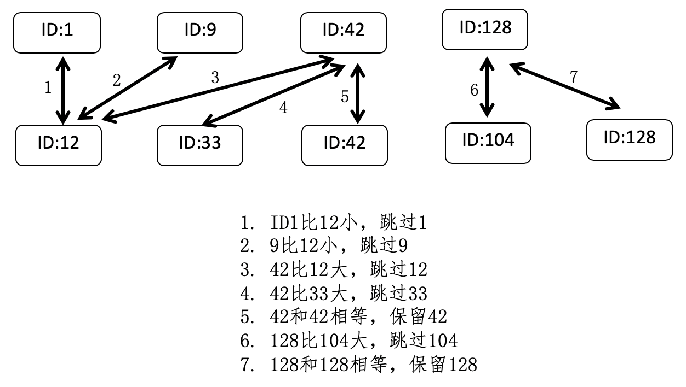

<!-- TOC -->

- [搜索引擎的设计框架](#搜索引擎的设计框架)
- [倒排索引的设计](#倒排索引的设计)
- [向量空间和倒排索引的结合](#向量空间和倒排索引的结合)

<!-- /TOC -->
## 搜索引擎的设计框架
之前在讲解向量空间模型的时候，我们介绍了信息检索的基础知识，而我们平时经常使用的搜索引擎，就是一种典型的信息检索系统。在
讲解如何结合倒排索引和向量空间模型之前，我们先来看，常见的文本搜索引擎都由哪些模块组成。
文本搜索系统的框架通常包括 2 个重要模块：**离线的预处理**和**在线的查询**。离线预处理也就是我们通常所说的“索引”阶段，包括数据获取、文本预处理、词典和倒排索引的构建、相关性模型的数据统计等。数据的获取和相关性模型的数据统计这两步，根据不同的应用场景，必要性和处理方式有所不同。可是，**文本预处理**和**倒排索引构建**这两个步骤，无论在何种应用场景之中都是必不可少的，所以它们是离线阶段的核心。之前我们讲过，常规的文本预处理是指针对文本进行分词、移除停用词、取词干、归一化、扩充同义词和近义词等操作。
在第 17 讲里，我讲解了如何使用倒排索引，把文档集转换为从关键词到文档的这种查找关系。有了这种“倒排”的关系，我们可以很高效地根据给定的单词，找到出现过这个单词的文档集合。
倒排索引是典型的牺牲空间来换取时间的方法。我们假设文章总数是 k，每篇文章的单词数量是 m，查询中平均的关键词数量是 l，那么倒排索引可以把时间复杂度从 O(k×logm) 降到 O(l)。但是，如果使用倒排索引，就意味着除了原始数据，我们还需要额外的存储空间来放置倒排索引。因此，如果我们的字典里，不同的词条总数为 n1​，每个单词所对应的文章平均数为 n2​，那么空间复杂度就是 O(n1​×n2​)。
在文本的离线处理完毕后，我们来看在线的文本查询。这个过程相对简单。查询一般都会使用和离线模块一样的预处理，词典也是沿用离线处理的结果。当然，也可能会出现离线处理中未曾出现过的新词，我们一般会忽略或给予非常小的权重。在此基础上，系统根据用户输入的查询条件，在倒排索引中快速检出文档，并进行相关性的计算。不同的相关性模型，有不同的计算方式。最简单的布尔模型只需要计算若干匹配条件的交集，向量空间模型 VSM，则需要计算查询向量和待查文档向量的余弦夹角，而语言模型需要计算匹配条件的贝叶斯概率等等。
综合上述的介绍，我使用下面这张图来展示搜索引擎的框架设计。

## 倒排索引的设计
我们之前已经把倒排索引的概念讲清楚了。不过到具体设计的时候，除了从关键词到文档这种“倒排”的关系，还有其它两个要点值得考虑：第一个是倒排索引里具体存储什么内容，第二个就是多个关键词的查询结果如何取交集。
我们下面一个个来看。首先我们来聊聊倒排索引里具体存放的内容。从倒排索引的概念，我们很容易就想到使用哈希表、尤其是基于链式地址法的哈希表来实现倒排索引。哈希的键（key）就是文档词典的某一个词条，值（value）就是一个链表，链表是出现这个词条的所有文档之集合，而链表的每一个结点，就表示出现过这个词条的某一篇文档。这种最简单的设计能够帮助我们判断哪些文档出现过给定的词条，因此它可以用于布尔模型。但是，如果我们要实现向量空间模型，或者是基于概率的检索模型，就需要很多额外的信息，比如词频（tf）、词频 - 逆文档频率（tf-idf）、词条出现的条件概率等等。另外，有些搜索引擎需要返回匹配到的信息摘要（nippet），因此还需要记住词条出现的位置。这个时候，最简单的倒排索引就无法满足我们的需求了。我们要在倒排索引中加入更多的信息。每个文档列表中，存储的不仅仅是文档的 ID，还有其他额外的信息。我使用下面这张图展示了一个示例，帮助你理解这种新的设计

其中，ID 字段表示文档的 ID，tf 字段表示词频，tfidf 字段表示词频 - 逆文档频率，而 prob 表示这个词条在这篇文档中出现的条件概率。
好了，下面我们来看，如何确定出现所有多个关键词的文档。由于倒排索引本身的特性，我们可以很快知道某一个词条对应的文档，也就是说查找出现某一个词条的所有文档是很容易的。可是，如果用户的查询包含多个关键词，那么该如何利用倒排索引，查找出现多个词条的所有文档呢？
还记得我讲解分治法时，所提到的归并排序吗？在这里，我们可以借鉴其中的合并步骤。假设有两个词条 a 和 b，a 对应的文档列表是 A，b 对应的文档列表是 B，而 A 和 B 这两个列表中的每一个元素都包含了文档的 ID。
首先，我们根据文档的 ID，分别对这两个列表进行从小到大的排序，然后依次比较两个列表的文档 ID，如果当前的两个 ID 相等，就表示这个 ID 所对应的文档同时包含了 a 和 b 两个关键词，所以是符合要求的，进行保留，然后两个列表都拿出下一个 ID 进行之后的对比。如果列表 A 的当前 ID 小于列表 B 的当前 ID，那么表明 A 中的这个 ID 一定不符合要求，跳过它，然后拿出 A 中的下一个 ID 和 B 进行比较。同样，如果是列表 B 的第一个 ID 更小，那么就跳过 B 中的这个 ID，拿出 B 中的下一个 ID 和 A 进行比较。依次类推，直到遍历完所有 A 和 B 中的 ID
我画了张图来进一步解释这个过程。 
基于这种两两比较的过程，我们可以推广到比较任意多的列表。此外，在构建倒排索引的时候，我们可以事先对每个词条的文档列表进行排序，从而避免了查询时候的排序过程，达到提升搜索效率的目的。

## 向量空间和倒排索引的结合
有了倒排索引的高效查询，向量空间的实现就不难了。还记得之前我们讲解的向量空间模型吗？这个模型假设所有的对象都可以转化为向量，然后使用向量间的距离（通常是欧氏距离）或者是向量间的夹角余弦来表示两个对象之间的相似程度。
在文本搜索引擎中，我们使用向量来表示每个文档以及用户的查询，而向量的每个分量由每个词条的 tf-idf 构成，最终用户查询和文档之间的相似度或者说相关性，由文档向量和查询向量的夹角余弦确定。如果能获取这个查询和所有文档之间的相关性得分，那么我们就能对文档进行排序，返回最相关的那些。不过，当文档集合很大的时候，这个操作的复杂度会很高。你可以观察一下这个夹角余弦的公式 , 

如果文档中词条的平均数量是 n，查询中词条的平均数量是 m，那么计算某个查询和某个文档之间的夹角余弦，时间复杂度是 O(n×m)。如果整个被索引的文档集合有 k 个文档，那么计算某个查询和所有文档之间的夹角余弦，时间复杂度就变为 O(n×m×k)。
实际上，很多文档并没有出现查询中的关键词条，所以计算出来的夹角余弦都是 0，而这些计算都是可以完全避免的，解决方案就是倒排索引。通过倒排索引，我们挑选出那些出现过查询关键词的文档，并仅仅针对这些文档进行夹角余弦的计算，那么计算量就会大大减少。此外，我们之前设计的倒排索引也已经保存了 tf-idf 这种信息，因此可以直接利用从倒排索引中取出的 tf-idf 值计算夹角余弦公式的分子部分。至于分母部分，它包含了用户查询向量的和文档向量的 L2 范数。
通常，查询向量所包含的非 0 分量很少，L2 范数计算是很快的。而每篇文档的 L2 范数，在文档没有更新的情况下是不变的，因此我们可以在索引阶段，就计算好并保持在额外的数据结构之中
