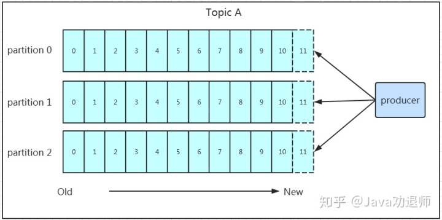

[仅需3分钟，你就能明白Kafka的工作原理](https://zhuanlan.zhihu.com/p/68105258)

周末无聊刷着手机，某宝网 App 突然蹦出来一条消息“为了回馈老客户，女朋友买一送一，活动仅限今天！”。
买一送一还有这种好事，那我可不能错过！忍不住立马点了去。于是选了两个最新款，下单、支付一气呵成！满足的躺在床上，想着马上有女朋友了，竟然幸福的失眠了……第二天正常上着班，突然接到快递小哥的电话：小哥：“你是 xx 吗？你的女朋友到了，我现在在你楼下，你来拿一下吧！”。我：“这……我在上班呢，可以晚上送过来吗？“。小哥：“晚上可不行哦，晚上我也下班了呢！”。于是两个人僵持了很久……最后小哥说，要不我帮你放到楼下小芳便利店吧，你晚上下班了过来拿，尴尬的局面这才得以缓解！
为什么需要消息队列回到正题，如果没有小芳便利店，那快递小哥和我的交互图就应 

：会出现什么情况呢？为了这个女朋友，我请假回去拿（老板不批）。小哥一直在你楼下等（小哥还有其他的快递要送）。周末再送（显然等不及）。这个女朋友我不要了（绝对不可能）！小芳便利店出现后，交互图如下 

：在上面例子中，“快递小哥”和“买女朋友的我”就是需要交互的两个系统，小芳便利店就是我们本文要讲的消息中间件。总结下来小芳便利店（消息中间件）出现后有如下好处：

解耦

快递小哥手上有很多快递需要送，他每次都需要先电话一一确认收货人是否有空、哪个时间段有空，然后再确定好送货的方案。这样完全依赖收货人了！如果快递一多，快递小哥估计得忙疯了……如果有了便利店，快递小哥只需要将同一个小区的快递放在同一个便利店，然后通知收货人来取货就可以了，这时候快递小哥和收货人就实现了解耦！

异步

快递小哥打电话给我后需要一直在你楼下等着，直到我拿走你的快递他才能去送其他人的。快递小哥将快递放在小芳便利店后，又可以干其他的活儿去了，不需要等待你到来而一直处于等待状态，提高了工作的效率。

削峰

假设双十一我买了不同店里的各种商品，而恰巧这些店发货的快递都不一样，有中通、圆通、申通、各种通等……更巧的是他们都同时到货了！中通的小哥打来电话叫我去北门取快递、圆通小哥叫我去南门、申通小哥叫我去东门。我一时手忙脚乱……我们能看到在系统需要交互的场景中，使用消息队列中间件真的是好处多多，基于这种思路，就有了丰巢、菜鸟驿站等比小芳便利店更专业的“中间件”了。最后，上面的故事纯属虚构……

消息队列通信的模式

通过上面的例子我们引出了消息中间件，并且介绍了消息队列出现后的好处，这里就需要介绍消息队列通信的两种模式了：点对点模式如上图所示，

点对点模式

通常是基于拉取或者轮询的消息传送模型，这个模型的特点是发送到队列的消息被一个且只有一个消费者进行处理。生产者将消息放入消息队列后，由消费者主动的去拉取消息进行消费。点对点模型的优点是消费者拉取消息的频率可以由自己控制。但是消息队列是否有消息需要消费，在消费者端无法感知，所以在消费者端需要额外的线程去监控。

发布订阅模式

如上图所示，发布订阅模式是一个基于消息送的消息传送模型，该模型可以有多种不同的订阅者。生产者将消息放入消息队列后，队列会将消息推送给订阅过该类消息的消费者（类似微信公众号）。
由于是消费者被动接收推送，所以无需感知消息队列是否有待消费的消息！但是 Consumer1、Consumer2、Consumer3 由于机器性能不一样，所以处理消息的能力也会不一样，但消息队列却无法感知消费者消费的速度！所以推送的速度成了发布订阅模式的一个问题！假设三个消费者处理速度分别是 8M/s、5M/s、2M/s，如果队列推送的速度为 5M/s，则 Consumer3 无法承受！如果队列推送的速度为 2M/s，则 Consumer1、Consumer2 会出现资源的极大浪费！

Kafka

上面简单的介绍了为什么需要消息队列以及消息队列通信的两种模式，接下来就到了我们本文的主角 Kafka 闪亮登场的时候了！Kafka 是一种高吞吐量的分布式发布订阅消息系统，它可以处理消费者规模的网站中的所有动作流数据，具有高性能、持久化、多副本备份、横向扩展能力……… 

基础架构及术语

话不多说，先看图，通过这张图我们来捋一捋相关的概念及之间的关系：

如果看到这张图你很懵逼，木有关系！我们先来分析相关概念：
Producer：Producer 即生产者，消息的产生者，是消息的入口。
Kafka Cluster：
Broker：Broker 是 Kafka 实例，每个服务器上有一个或多个 Kafka 的实例，我们姑且认为每个 Broker 对应一台服务器。每个 Kafka 集群内的 Broker 都有一个不重复的编号，如图中的 Broker-0、Broker-1 等……
Topic：消息的主题，可以理解为消息的分类，Kafka 的数据就保存在 Topic。在每个 Broker 上都可以创建多个 Topic。
Partition：Topic 的分区，每个 Topic 可以有多个分区，分区的作用是做负载，提高 Kafka 的吞吐量。同一个 Topic 在不同的分区的数据是不重复的，Partition 的表现形式就是一个一个的文件夹！
Replication：每一个分区都有多个副本，副本的作用是做备胎。当主分区（Leader）故障的时候会选择一个备胎（Follower）上位，成为 Leader。在 Kafka 中默认副本的最大数量是 10 个，且副本的数量不能大于 Broker 的数量，Follower 和 Leader 绝对是在不同的机器，同一机器对同一个分区也只可能存放一个副本（包括自己）。Message：每一条发送的消息主体。
Consumer：消费者，即消息的消费方，是消息的出口。
Consumer Group：我们可以将多个消费组组成一个消费者组，在 Kafka 的设计中同一个分区的数据只能被消费者组中的某一个消费者消费。同一个消费者组的消费者可以消费同一个 Topic 的不同分区的数据，这也是为了提高 Kafka 的吞吐量！
Zookeeper：Kafka 集群依赖 Zookeeper 来保存集群的的元信息，来保证系统的可用性。

工作流程分析
上面介绍了 Kafka 的基础架构及基本概念，不知道大家看完有没有对 Kafka 有个大致印象，如果还比较懵也没关系！我们接下来再结合上面的结构图分析 Kafka 的工作流程，最后再回来整个梳理一遍我相信你会更有收获！

发送数据

我们看上面的架构图中，Producer 就是生产者，是数据的入口。注意看图中的红色箭头，Producer 在写入数据的时候永远在找 Leader，不会直接将数据写入 Follower！那 Leader 怎么找呢？写入的流程又是什么样的呢？我们看下图：

发送的流程就在图中已经说明了，就不单独在文字列出来了！需要注意的一点是，消息写入 Leader 后，Follower 是主动的去 Leader 进行同步的！Producer 采用 Push 模式将数据发布到 Broker，每条消息追加到分区中，顺序写入磁盘，所以保证同一分区内的数据是有序的！写入示意图如下：

上面说到数据会写入到不同的分区，那 Kafka 为什么要做分区呢？相信大家应该也能猜到，分区的主要目的是：

方便扩展。因为一个 Topic 可以有多个 Partition，所以我们可以通过扩展机器去轻松的应对日益增长的数据量。
提高并发。以 Partition 为读写单位，可以多个消费者同时消费数据，提高了消息的处理效率。熟悉负载均衡的朋友应该知道，当我们向某个服务器发送请求的时候，服务端可能会对请求做一个负载，将流量分发到不同的服务器。那在 Kafka 中，如果某个 Topic 有多个 Partition，Producer 又怎么知道该将数据发往哪个 Partition 呢？

Kafka 中有几个原则：
Partition 在写入的时候可以指定需要写入的 Partition，
如果有指定，则写入对应的 Partition。如果没有指定 Partition，但是设置了数据的 Key，则会根据 Key 的值 Hash 出一个 Partition。
如果既没指定 Partition，又没有设置 Key，则会轮询选出一个 Partition。

保证消息不丢失是一个消息队列中间件的基本保证，那 Producer 在向 Kafka 写入消息的时候，怎么保证消息不丢失呢？其实上面的写入流程图中有描述出来，那就是通过 ACK 应答机制！在生产者向队列写入数据的时候可以设置参数来确定是否确认 Kafka 接收到数据，这个参数可设置的值为 0、1、all：
0 代表 Producer 往集群发送数据不需要等到集群的返回，不确保消息发送成功。安全性最低但是效率最高。
1 代表 Producer 往集群发送数据只要 Leader 应答就可以发送下一条，只确保 Leader 发送成功。
all 代表 Producer 往集群发送数据需要所有的 Follower 都完成从 Leader 的同步才会发送下一条，确保 Leader 发送成功和所有的副本都完成备份。安全性最高，但是效率最低。

最后要注意的是，如果往不存在的 Topic 写数据，能不能写入成功呢？Kafka 会自动创建 Topic，分区和副本的数量根据默认配置都是 1。保存数据Producer 将数据写入 Kafka 后，集群就需要对数据进行保存了！Kafka 将数据保存在磁盘，可能在我们的一般的认知里，写入磁盘是比较耗时的操作，不适合这种高并发的组件。Kafka 初始会单独开辟一块磁盘空间，顺序写入数据（效率比随机写入高）。①Partition 结构前面说过了每个 Topic 都可以分为一个或多个 Partition，如果你觉得 Topic 比较抽象，那 Partition 就是比较具体的东西了！Partition 在服务器上的表现形式就是一个一个的文件夹，每个 Partition 的文件夹下面会有多组 Segment 文件。每组 Segment 文件又包含 .index 文件、.log 文件、.timeindex 文件（早期版本中没有）三个文件。Log 文件就是实际存储 Message 的地方，而 Index 和 Timeindex 文件为索引文件，用于检索消息。

如上图，这个 Partition 有三组 Segment 文件，每个 Log 文件的大小是一样的，但是存储的 Message 数量是不一定相等的（每条的 Message 大小不一致）。文件的命名是以该 Segment 最小 Offset 来命名的，如 000.index 存储 Offset 为 0~368795 的消息，Kafka 就是利用分段+索引的方式来解决查找效率的问题。

②Message 

结构上面说到 Log 文件就实际是存储 Message 的地方，我们在 Producer 往 Kafka 写入的也是一条一条的 Message。那存储在 Log 中的 Message 是什么样子的呢？消息主要包含消息体、消息大小、Offset、压缩类型……等等！我们重点需要知道的是下面三个：

Offset：Offset 是一个占 8byte 的有序 id 号，它可以唯一确定每条消息在 Parition 内的位置！
消息大小：消息大小占用 4byte，用于描述消息的大小。
消息体：消息体存放的是实际的消息数据（被压缩过），占用的空间根据具体的消息而不一样。

③存储策略无论消息是否被消费，Kafka 都会保存所有的消息。那对于旧数据有什么删除策略呢？
基于时间，默认配置是 168 小时（7 天）。
基于大小，默认配置是 1073741824。
需要注意的是，Kafka 读取特定消息的时间复杂度是 O(1)，所以这里删除过期的文件并不会提高 Kafka 的性能！

消费数据

消息存储在 Log 文件后，消费者就可以进行消费了。在讲消息队列通信的两种模式的时候讲到过点对点模式和发布订阅模式。Kafka 采用的是点对点的模式，消费者主动的去 Kafka 集群拉取消息，与 Producer 相同的是，消费者在拉取消息的时候也是找 Leader 去拉取。多个消费者可以组成一个消费者组（Consumer Group），每个消费者组都有一个组 id！同一个消费组者的消费者可以消费同一 Topic 下不同分区的数据，但是不会组内多个消费者消费同一分区的数据！是不是有点绕？我们看下图：

图示是消费者组内的消费者小于 Partition 数量的情况，所以会出现某个消费者消费多个 Partition 数据的情况，消费的速度也就不及只处理一个 Partition 的消费者的处理速度！如果是消费者组的消费者多于 Partition 的数量，那会不会出现多个消费者消费同一个 Partition 的数据呢？上面已经提到过不会出现这种情况！多出来的消费者不消费任何 Partition 的数据。所以在实际的应用中，建议消费者组的 Consumer 的数量与 Partition 的数量一致！在保存数据的小节里面，我们聊到了 Partition 划分为多组 Segment，每个 Segment 又包含 .log、.index、.timeindex 文件，存放的每条 Message 包含 Offset、消息大小、消息体……

我们多次提到 Segment 和 Offset，查找消息的时候是怎么利用 Segment+Offset 配合查找的呢？假如现在需要查找一个 Offset 为 368801 的 Message 是什么样的过程呢？我们先看看下面的图：

①先找到 Offset 的 368801message 所在的 Segment 文件（利用二分法查找），这里找到的就是在第二个 Segment 文件。②打开找到的 Segment 中的 .index 文件（也就是 368796.index 文件，该文件起始偏移量为 368796+1。我们要查找的 Offset 为 368801 的 Message 在该 Index 内的偏移量为 368796+5=368801，所以这里要查找的相对 Offset 为 5）。由于该文件采用的是稀疏索引的方式存储着相对 Offset 及对应 Message 物理偏移量的关系，所以直接找相对 Offset 为 5 的索引找不到。这里同样利用二分法查找相对 Offset 小于或者等于指定的相对 Offset 的索引条目中最大的那个相对 Offset，所以找到的是相对 Offset 为 4 的这个索引。③根据找到的相对 Offset 为 4 的索引确定 Message 存储的物理偏移位置为 256。打开数据文件，从位置为 256 的那个地方开始顺序扫描直到找到 Offset 为 368801 的那条 Message。这套机制是建立在 Offset 为有序的基础上，利用 Segment+有序 Offset+稀疏索引+二分查找+顺序查找等多种手段来高效的查找数据！至此，消费者就能拿到需要处理的数据进行处理了。那每个消费者又是怎么记录自己消费的位置呢？在早期的版本中，消费者将消费到的 Offset 维护在 Zookeeper 中，Consumer 每间隔一段时间上报一次，这里容易导致重复消费，且性能不好！在新的版本中消费者消费到的 Offset 已经直接维护在 Kafka 集群的 __consumer_offsets 这个 Topic 中！